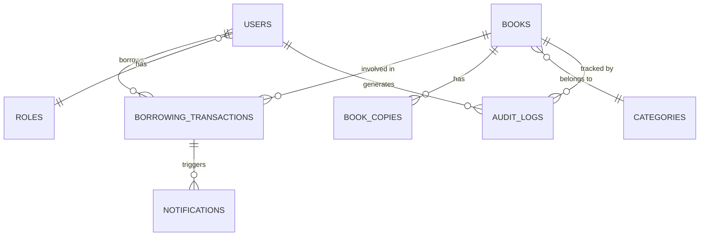

# Database Schema & Team Plan

## School Library Management System — Group 6

---

## 1. Database Schema

Derived from: REQ-1 through REQ-16, UC-01 through UC-12, and the domain model (Book, User, BorrowingTransaction, Catalog).

---

### Entity Relationship Overview

---

### Tables

#### `roles`

> Supports REQ-6, REQ-18 — Role-based access control

| Column        | Type        | Constraints                                                   |
| ------------- | ----------- | ------------------------------------------------------------- |
| `id`          | INT         | PK, AUTO_INCREMENT                                            |
| `name`        | VARCHAR(50) | NOT NULL, UNIQUE (`student`, `teacher`, `librarian`, `admin`) |
| `description` | TEXT        | NULLABLE                                                      |
| `created_at`  | TIMESTAMP   | DEFAULT NOW()                                                 |

---

#### `users`

> Supports REQ-5, REQ-6, REQ-17 — User accounts, roles, authentication

| Column          | Type         | Constraints               |
| --------------- | ------------ | ------------------------- |
| `id`            | INT          | PK, AUTO_INCREMENT        |
| `full_name`     | VARCHAR(100) | NOT NULL                  |
| `username`      | VARCHAR(50)  | NOT NULL, UNIQUE          |
| `email`         | VARCHAR(150) | NOT NULL, UNIQUE          |
| `password_hash` | VARCHAR(255) | NOT NULL                  |
| `role_id`       | INT          | FK → `roles.id`, NOT NULL |
| `is_active`     | BOOLEAN      | DEFAULT TRUE              |
| `created_at`    | TIMESTAMP    | DEFAULT NOW()             |
| `updated_at`    | TIMESTAMP    | ON UPDATE NOW()           |

---

#### `categories`

> Supports REQ-1, REQ-3 — Book categorization and search

| Column        | Type         | Constraints        |
| ------------- | ------------ | ------------------ |
| `id`          | INT          | PK, AUTO_INCREMENT |
| `name`        | VARCHAR(100) | NOT NULL, UNIQUE   |
| `description` | TEXT         | NULLABLE           |

---

#### `books`

> Supports REQ-1, REQ-2, REQ-3, REQ-4 — Central catalog

| Column             | Type         | Constraints          |
| ------------------ | ------------ | -------------------- |
| `id`               | INT          | PK, AUTO_INCREMENT   |
| `title`            | VARCHAR(255) | NOT NULL             |
| `author`           | VARCHAR(150) | NOT NULL             |
| `isbn`             | VARCHAR(20)  | UNIQUE, NULLABLE     |
| `category_id`      | INT          | FK → `categories.id` |
| `publisher`        | VARCHAR(150) | NULLABLE             |
| `publication_year` | YEAR         | NULLABLE             |
| `description`      | TEXT         | NULLABLE             |
| `cover_image_url`  | VARCHAR(500) | NULLABLE             |
| `created_at`       | TIMESTAMP    | DEFAULT NOW()        |
| `updated_at`       | TIMESTAMP    | ON UPDATE NOW()      |

> **Note:** `total_copies` and `available_copies` are computed from `book_copies` (`COUNT(*)` and `COUNT(status='available')`) and are not stored on `books`.

---

#### `book_copies`

> Supports REQ-2, REQ-4 — Track individual physical copies and their status

| Column       | Type         | Constraints                                                                      |
| ------------ | ------------ | -------------------------------------------------------------------------------- |
| `id`         | INT          | PK, AUTO_INCREMENT                                                               |
| `book_id`    | INT          | FK → `books.id`, NOT NULL                                                        |
| `barcode`    | VARCHAR(50)  | UNIQUE, NULLABLE                                                                 |
| `status`     | ENUM         | `available`, `borrowed`, `reserved`, `lost`, `unavailable` — DEFAULT `available` |
| `location`   | VARCHAR(100) | NULLABLE (shelf/section)                                                         |
| `created_at` | TIMESTAMP    | DEFAULT NOW()                                                                    |
| `updated_at` | TIMESTAMP    | ON UPDATE NOW()                                                                  |

---

#### `borrowing_policies`

> Supports REQ-9 — Configurable loan duration and limits per role

| Column               | Type      | Constraints               |
| -------------------- | --------- | ------------------------- |
| `id`                 | INT       | PK, AUTO_INCREMENT        |
| `role_id`            | INT       | FK → `roles.id`, NOT NULL |
| `loan_duration_days` | INT       | NOT NULL, DEFAULT 14      |
| `max_books_allowed`  | INT       | NOT NULL, DEFAULT 3       |
| `created_at`         | TIMESTAMP | DEFAULT NOW()             |

---

#### `borrowing_transactions`

> Supports REQ-7, REQ-8, REQ-9, REQ-10, REQ-13 — Core checkout/return tracking

| Column          | Type      | Constraints                                        |
| --------------- | --------- | -------------------------------------------------- |
| `id`            | INT       | PK, AUTO_INCREMENT                                 |
| `book_copy_id`  | INT       | FK → `book_copies.id`, NOT NULL                    |
| `borrower_id`   | INT       | FK → `users.id`, NOT NULL                          |
| `librarian_id`  | INT       | FK → `users.id`, NOT NULL                          |
| `checkout_date` | DATE      | NOT NULL                                           |
| `due_date`      | DATE      | NOT NULL                                           |
| `return_date`   | DATE      | NULLABLE (NULL = still borrowed)                   |
| `status`        | ENUM      | `active`, `returned`, `overdue` — DEFAULT `active` |
| `notes`         | TEXT      | NULLABLE                                           |
| `created_at`    | TIMESTAMP | DEFAULT NOW()                                      |
| `updated_at`    | TIMESTAMP | ON UPDATE NOW()                                    |

> **Index:** `(borrower_id, status)` for fast overdue lookups.

---

#### `notifications`

> Supports REQ-12 — Due date reminders and overdue alerts

| Column           | Type      | Constraints                                |
| ---------------- | --------- | ------------------------------------------ |
| `id`             | INT       | PK, AUTO_INCREMENT                         |
| `user_id`        | INT       | FK → `users.id`, NOT NULL                  |
| `transaction_id` | INT       | FK → `borrowing_transactions.id`, NULLABLE |
| `type`           | ENUM      | `due_reminder`, `overdue_alert`, `system`  |
| `message`        | TEXT      | NOT NULL                                   |
| `is_read`        | BOOLEAN   | DEFAULT FALSE                              |
| `sent_at`        | TIMESTAMP | DEFAULT NOW()                              |

---

#### `audit_logs`

> Supports REQ-15, REQ-25 — Accountability trail for critical actions

| Column        | Type         | Constraints                                                   |
| ------------- | ------------ | ------------------------------------------------------------- |
| `id`          | INT          | PK, AUTO_INCREMENT                                            |
| `actor_id`    | INT          | FK → `users.id`, NULLABLE (NULL = system)                     |
| `action`      | VARCHAR(100) | NOT NULL (e.g., `CHECKOUT`, `RETURN`, `ROLE_CHANGE`, `LOGIN`) |
| `target_type` | VARCHAR(50)  | NULLABLE (e.g., `book`, `user`, `transaction`)                |
| `target_id`   | INT          | NULLABLE                                                      |
| `details`     | JSON         | NULLABLE (before/after values)                                |
| `ip_address`  | VARCHAR(45)  | NULLABLE                                                      |
| `created_at`  | TIMESTAMP    | DEFAULT NOW()                                                 |

---

#### `reports` _(optional — for saved report snapshots)_

> Supports REQ-14, REQ-16

| Column         | Type         | Constraints                                             |
| -------------- | ------------ | ------------------------------------------------------- |
| `id`           | INT          | PK, AUTO_INCREMENT                                      |
| `generated_by` | INT          | FK → `users.id`                                         |
| `report_type`  | ENUM         | `inventory`, `usage`, `popular_books`, `overdue_trends` |
| `file_url`     | VARCHAR(500) | NULLABLE (CSV export path)                              |
| `generated_at` | TIMESTAMP    | DEFAULT NOW()                                           |

---

### Key Relationships Summary

| Relationship                               | Type        | Description                                      |
| ------------------------------------------ | ----------- | ------------------------------------------------ |
| `users` → `roles`                          | Many-to-One | Each user has one role                           |
| `books` → `categories`                     | Many-to-One | Each book belongs to one category                |
| `books` → `book_copies`                    | One-to-Many | A book has multiple physical copies              |
| `book_copies` → `borrowing_transactions`   | One-to-Many | A copy can be borrowed many times (sequentially) |
| `users` → `borrowing_transactions`         | One-to-Many | A user can have many transactions                |
| `roles` → `borrowing_policies`             | One-to-One  | Each role has a borrowing policy                 |
| `borrowing_transactions` → `notifications` | One-to-Many | A transaction can trigger multiple notifications |

---

## 2. Team Responsibility Breakdown

Based on individual competencies from the report and the 2-iteration Agile plan.

---

### Iteration 1 — Core Circulation (Login, Search, Checkout, Return)

| Task                                                | Norint Ros | Sopanhariem Soeun | Laytong Ly | Norithisak Teng |
| --------------------------------------------------- | ---------- | ----------------- | ---------- | --------------- |
| **Database setup & migrations**                     | ✅ Lead    | —                 | Support    | —               |
| **Auth API** (UC-01, REQ-6, REQ-17, REQ-18)         | ✅ Lead    | —                 | Support    | —               |
| **Login UI** (REQ-26)                               | —          | ✅ Lead           | Support    | —               |
| **Search Catalog API** (UC-02, REQ-3, REQ-4)        | Support    | —                 | ✅ Lead    | —               |
| **Search UI** (REQ-27)                              | —          | ✅ Lead           | Support    | —               |
| **Book Detail UI** (REQ-28, UC-03)                  | —          | ✅ Lead           | —          | —               |
| **Checkout API** (UC-04, REQ-7, REQ-9)              | Support    | —                 | ✅ Lead    | —               |
| **Return API** (UC-05, REQ-8)                       | Support    | —                 | ✅ Lead    | —               |
| **Checkout/Return UI** (REQ-29)                     | —          | ✅ Lead           | Support    | —               |
| **Unit tests** (due date calc, availability update) | —          | —                 | —          | ✅ Lead         |
| **Integration tests** (checkout/return flow)        | —          | —                 | —          | ✅ Lead         |

---

### Iteration 2 — Administrative Features (Overdue, Reports, User Mgmt)

| Task                                                | Norint Ros | Sopanhariem Soeun | Laytong Ly | Norithisak Teng |
| --------------------------------------------------- | ---------- | ----------------- | ---------- | --------------- |
| **Overdue detection logic** (UC-06, REQ-10, REQ-11) | ✅ Lead    | —                 | Support    | —               |
| **Overdue UI** (REQ-30)                             | —          | ✅ Lead           | —          | —               |
| **Notifications** (REQ-12)                          | Support    | —                 | ✅ Lead    | —               |
| **User/Role management API** (UC-08, REQ-5, REQ-6)  | ✅ Lead    | —                 | Support    | —               |
| **Borrowing history UI** (UC-09, REQ-13)            | —          | ✅ Lead           | —          | —               |
| **Reports API** (UC-10, REQ-14, REQ-16)             | ✅ Lead    | —                 | —          | —               |
| **Reports UI + CSV export** (REQ-31)                | —          | ✅ Lead           | —          | —               |
| **Audit log** (UC-12, REQ-15, REQ-25)               | Support    | —                 | ✅ Lead    | —               |
| **End-to-end testing**                              | —          | —                 | —          | ✅ Lead         |
| **UI responsiveness** (REQ-32)                      | —          | ✅ Lead           | —          | —               |
| **Security review** (REQ-17, REQ-18)                | —          | —                 | —          | ✅ Lead         |

---

### Individual Summary

#### 🧑‍💻 Norint Ros — Backend & Database Lead

**Focus:** Database architecture, backend APIs, business logic
**Owns:** DB schema & migrations, Auth API, Overdue detection, User & role management API, Reports API
**Stack:** Express.js, PostgreSQL/MySQL
**Key Use Cases:** UC-01, UC-06, UC-08, UC-10, UC-12

#### 🎨 Sopanhariem Soeun — Frontend Lead

**Focus:** All UI pages, data visualization, UX
**Owns:** Login UI, Search UI, Book Detail UI, Checkout/Return UI, Overdue UI, Reports UI, Borrowing history UI, Responsive design
**Stack:** React.js, HTML/CSS
**Key Use Cases:** UC-02, UC-03, UC-04, UC-05, UC-09, UC-10

#### ⚙️ Laytong Ly — Full-Stack & Integration Lead

**Focus:** Core transaction APIs, frontend-backend integration, notifications
**Owns:** Search API, Checkout API, Return API, Notification system, Audit log, Frontend-backend integration, Project management
**Stack:** Node.js/Express or Spring Boot, React, MySQL/PostgreSQL
**Key Use Cases:** UC-02, UC-04, UC-05, UC-07, UC-09

#### 🧪 Norithisak Teng — QA & Testing Lead

**Focus:** System reliability, testing, security validation
**Owns:** Unit tests, Integration tests, E2E tests, Security review, NFR validation
**Stack:** Jest / testing frameworks
**Key Use Cases:** All (validation role)

---

## 3. Use Case → Table Mapping

| Use Case                     | Primary Tables Used                                                                           |
| ---------------------------- | --------------------------------------------------------------------------------------------- |
| UC-01 Login                  | `users`, `roles`, `audit_logs`                                                                |
| UC-02 Search Catalog         | `books`, `categories`, `book_copies`                                                          |
| UC-03 View Book Details      | `books`, `book_copies`, `categories`                                                          |
| UC-04 Checkout Book          | `borrowing_transactions`, `book_copies`, `books`, `users`, `borrowing_policies`, `audit_logs` |
| UC-05 Return Book            | `borrowing_transactions`, `book_copies`, `books`, `audit_logs`                                |
| UC-06 Overdue Management     | `borrowing_transactions`, `users`, `book_copies`, `notifications`                             |
| UC-07 Maintain Catalog       | `books`, `book_copies`, `categories`, `audit_logs`                                            |
| UC-08 Manage Users & Roles   | `users`, `roles`, `borrowing_policies`, `audit_logs`                                          |
| UC-09 View Borrowing History | `borrowing_transactions`, `book_copies`, `books`                                              |
| UC-10 Generate Reports       | `borrowing_transactions`, `books`, `users`, `reports`                                         |
| UC-11 Export/Import Data     | `reports`, all tables                                                                         |
| UC-12 Review Audit Trail     | `audit_logs`, `users`                                                                         |
